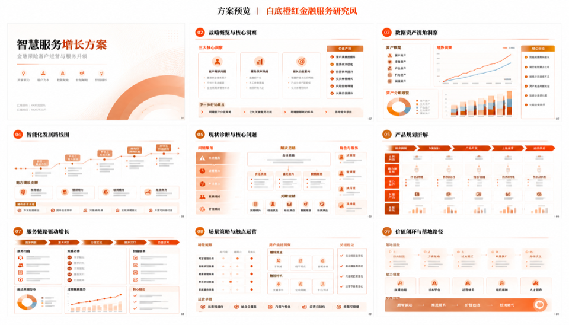
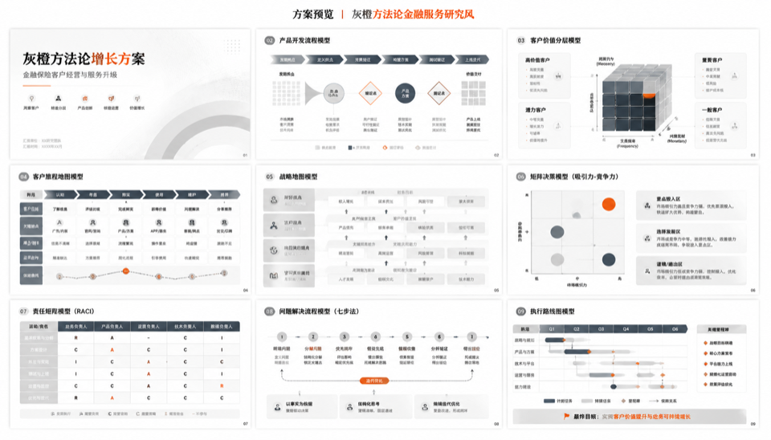
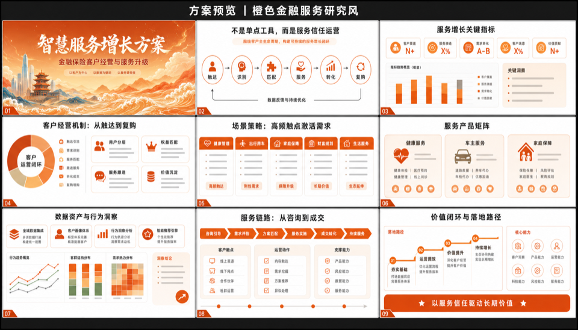

# Yenava Skills

这里收集的是我在实际工作里持续打磨、并且已经做成结构化 Skill 的能力模块。当前这一版先聚焦六类能力：

- **写书**：把技术主题组织成结构化书稿
- **排版导出**：把 Markdown 内容转成观感稳定的 PDF
- **小红书图文**：把主题拆成信息密度高的图文轮播，并输出 HTML/CSS 与最终图片
- **长图信息设计**：把内容排成杂志特稿风的长信息图，强调留白、节奏与手机端阅读体验
- **图像生成**：在 Codex API-key 环境里生成或编辑位图图片，支持参考图工作流
- **PPT 视觉设计**：从材料/文本到视觉预览、高清图片页和图片版 PPTX

这些 Skill 采用兼容 Agent Skills 的目录结构，适合在 Codex、Claude Code、以及其他支持 Skill 目录加载的 Agent 环境中继续维护和复用。

## Skills

| Skill | 中文名 | 说明 | 样例 |
|------|--------|------|------|
| [**technical-book-writer**](./technical-book-writer/) | 技术书写作 | 通用技术书籍创作 Skill。适合写技术书、手册、playbook、从入门到精通类长文书稿，包含结构方法论、书稿模板和 PDF 导出链路。 |   |
| [**content-to-pdf**](./content-to-pdf/) | 内容转 PDF | 通用内容排版导出 Skill。适合把 Markdown 文章、报告、brief、guide 等内容转换成排好版的 PDF。 | — |
| [**xiaohongshu-tuwen**](./xiaohongshu-tuwen/) | 小红书图文 | 小红书图文创作 Skill。适合把科技、商业、趋势、对比、方法论等主题拆成高信息密度的轮播页，自动选择主题模板，生成导演稿、HTML/CSS 页面并渲染成最终图片。 |   |
| [**longform-html-infographic**](./longform-html-infographic/) | 长图信息设计 | 长信息图排版 Skill。适合把过程、研究、说明、日志或复杂内容整理成一张长图，重点优化留白、叙事节奏、标题层级、中文断行和手机端阅读体验。 |  |
| [**new-imagegen**](./new-imagegen/) | 图像生成 | Codex API-key 环境下的图像生成与编辑 Skill。适合文生图、参考图改图、产品图、概念图、纹理、精灵图、背景图等位图资产生成。 | — |
| [**ppt-design**](./ppt-design/) | PPT 视觉设计 | 图片版 PPT 设计 Skill。适合把上传材料、文本和可选视觉参考转成 PPT 大纲、视觉拼图预览、高清单页图片，并合成为图片版 PPTX；支持橙红金融、灰橙方法论等脱敏视觉模板复用。 |    |

## 仓库结构

- 根目录直接按能力拆成独立 skill 文件夹
- 每个 skill 内部包含自己的 `SKILL.md`
- 有需要时再附带 `agents/`、`assets/`、`references/`、`examples/`、`scripts/`

## 使用方式

### 1. 克隆仓库

```bash
git clone https://github.com/yenava/yenava-skills.git
cd yenava-skills
```

### 2. 安装依赖

```bash
npm install
```

### 3. 按需复制或软链某个 Skill

常见 Skill 目录位置：

- Codex: `$CODEX_HOME/skills` 或 `~/.codex/skills`
- Claude Code: `~/.claude/skills`

例如：

```bash
cp -R technical-book-writer ~/.codex/skills/
cp -R content-to-pdf ~/.codex/skills/
cp -R xiaohongshu-tuwen ~/.codex/skills/
cp -R longform-html-infographic ~/.codex/skills/
cp -R new-imagegen ~/.codex/skills/
cp -R ppt-design ~/.codex/skills/
```

如果你更喜欢软链：

```bash
ln -s "$(pwd)/technical-book-writer" ~/.codex/skills/technical-book-writer
ln -s "$(pwd)/content-to-pdf" ~/.codex/skills/content-to-pdf
ln -s "$(pwd)/xiaohongshu-tuwen" ~/.codex/skills/xiaohongshu-tuwen
ln -s "$(pwd)/longform-html-infographic" ~/.codex/skills/longform-html-infographic
ln -s "$(pwd)/new-imagegen" ~/.codex/skills/new-imagegen
ln -s "$(pwd)/ppt-design" ~/.codex/skills/ppt-design
```

## 本地示例

```bash
npm run render:book-sample
npm run render:content-sample
```

示例输出会写到 `output/pdf/`。

## License

[MIT](./LICENSE)
