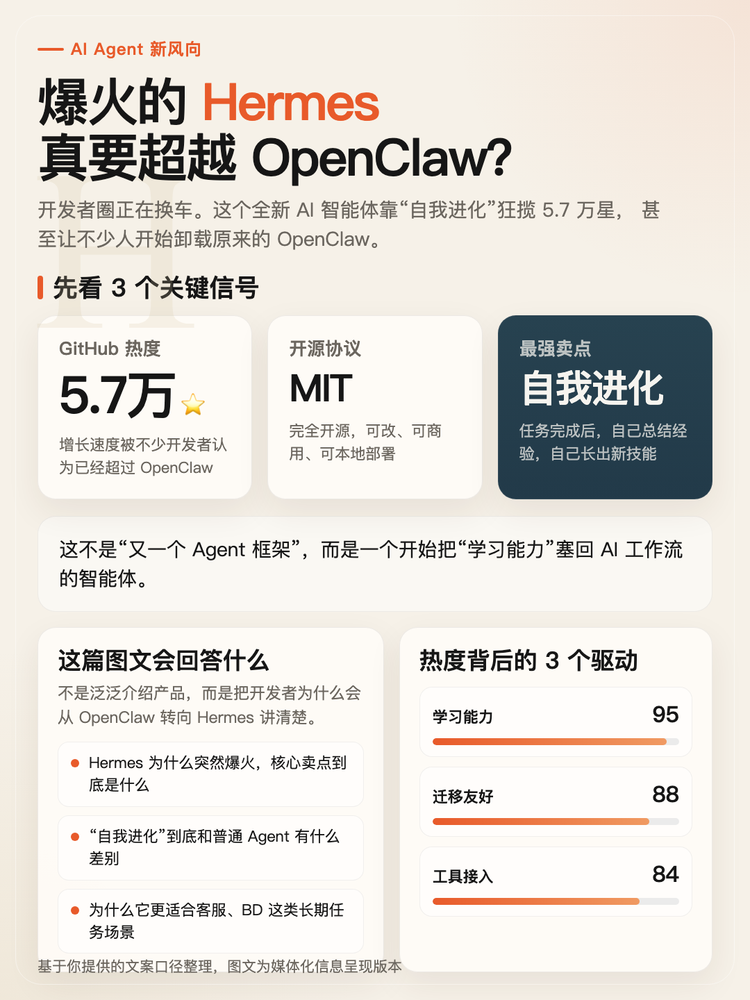
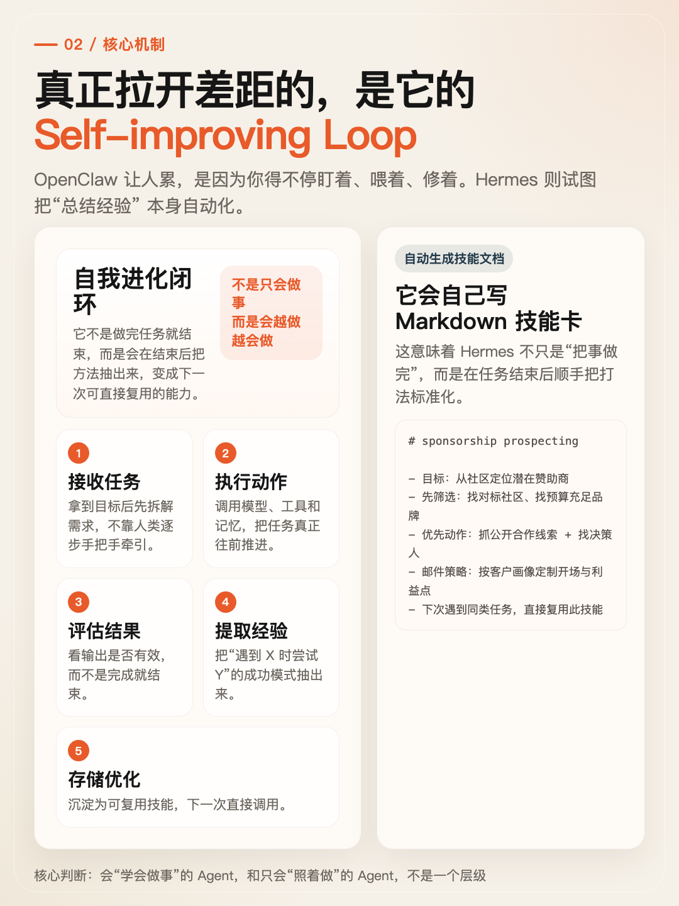
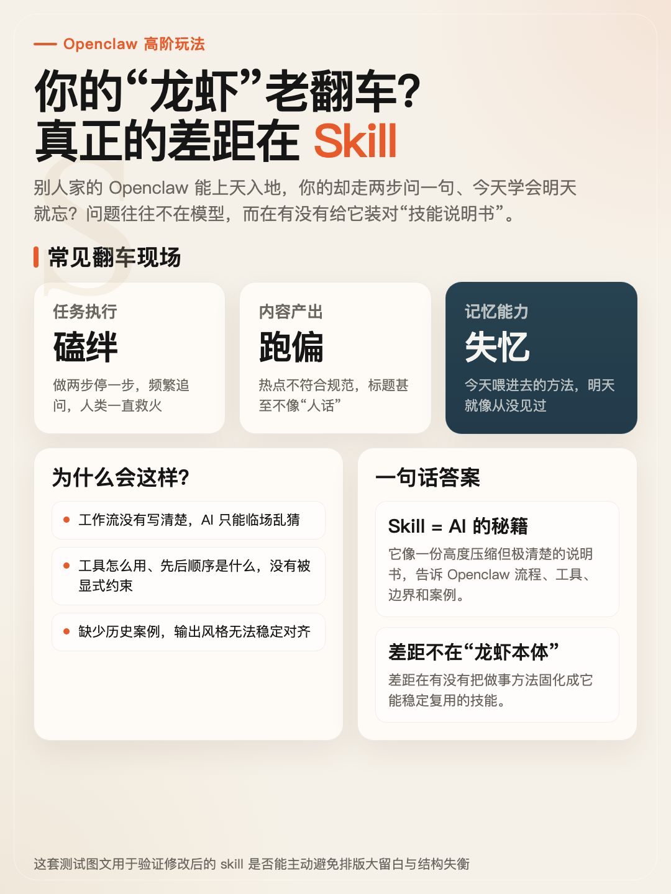
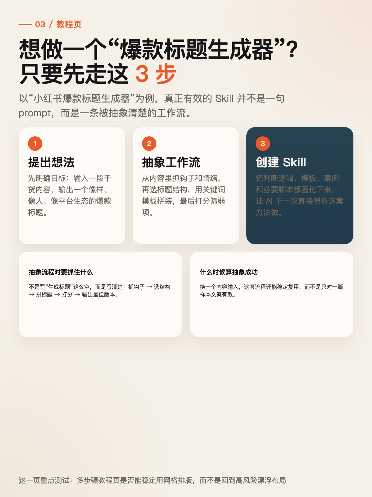
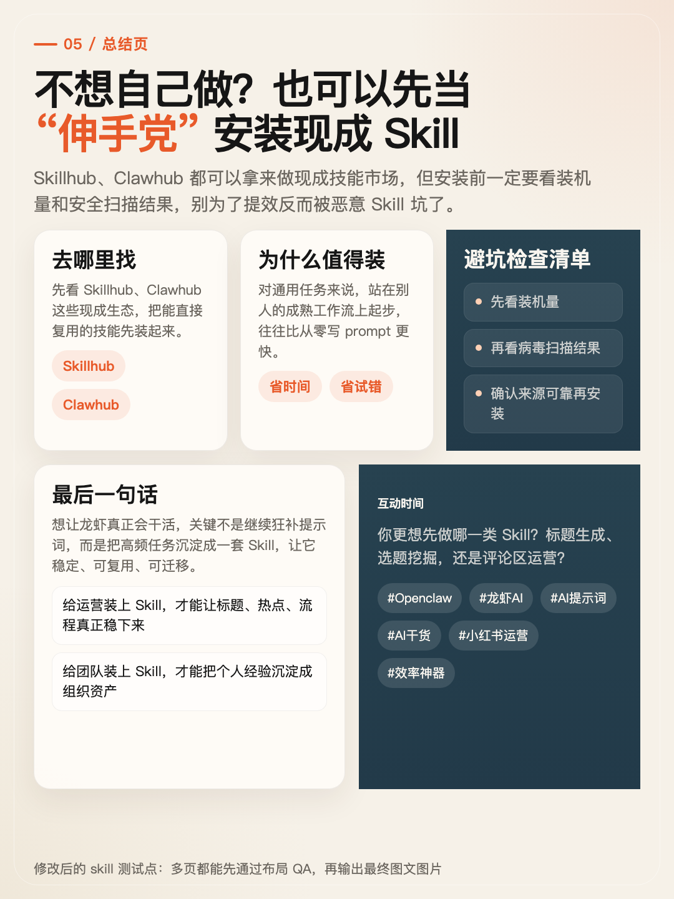

# Xiaohongshu Tuwen Skill

一个面向 Codex / Agent 工作流的“小红书图文创作 Skill”。

它不是只生成文案，而是把一个主题自动拆成适合小红书轮播的信息卡页面，产出：

- 页面结构与导演稿
- 可维护的 HTML / CSS 页面
- 渲染前布局 QA
- 最终 PNG 图文图片

适合做：

- 科技产品拆解图文
- 数据趋势图文
- 观点判断型轮播
- 教程型 / 方法型图文
- 对比型信息卡

## Showcase

### Hermes Agent 主题

| Page 1 | Page 3 |
| --- | --- |
|  |  |

### Openclaw Skill 主题

| Page 1 | Page 4 |
| --- | --- |
|  |  |

| Page 6 |
| --- |
|  |

## What This Skill Does

这套 skill 的核心不是“文生图”，而是“信息设计 + HTML/CSS 排版 + 浏览器渲染”：

1. 先理解主题、核心观点和证据类型
2. 自动按信息块决定页数，而不是机械固定 6 页
3. 生成每一页的版式结构与内容模块
4. 输出可编辑的 HTML / CSS
5. 在截图前做一轮布局 QA
6. 用 Playwright 渲染成最终图片

## Key Ideas

- 一页只表达一个核心判断
- 优先用数据卡、对比卡、列表、时间线，而不是大段说明
- 尽量使用流式布局，不依赖高风险漂浮定位
- 截图前先检查大留白、内容块过少、漂浮结构等排版风险
- 右上角位置默认是作者名位，未提供时留空

## Repo Structure

```text
.
├── SKILL.md
├── README.md
├── agents/
│   └── openai.yaml
├── assets/
│   ├── base.css
│   ├── page-template.html
│   └── showcase/
├── references/
│   ├── html-rendering.md
│   ├── layout-qa.md
│   ├── output-contract.md
│   ├── page-recipes.md
│   └── reverse-engineering.md
└── scripts/
    ├── check-layout.mjs
    └── render-pages.mjs
```

## Core Files

- [`SKILL.md`](./SKILL.md): 主 workflow，定义触发场景、拆页逻辑、HTML/CSS 生成规范、布局 QA 规则
- [`references/html-rendering.md`](./references/html-rendering.md): HTML 页面结构、渲染路径与使用方式
- [`references/layout-qa.md`](./references/layout-qa.md): 排版风险约束与布局体检规则
- [`scripts/check-layout.mjs`](./scripts/check-layout.mjs): 启发式布局检查
- [`scripts/render-pages.mjs`](./scripts/render-pages.mjs): 先跑布局检查，再用 Playwright 截图导出 PNG

## Quick Start

### 1. 让 Agent 生成轮播页面

用 `$xiaohongshu-tuwen` 处理一个主题，先生成 HTML / CSS 页面。

### 2. 检查布局

```bash
node scripts/check-layout.mjs output/xiaohongshu-tuwen/<topic-slug>
```

### 3. 渲染图片

```bash
node scripts/render-pages.mjs output/xiaohongshu-tuwen/<topic-slug>
```

默认渲染尺寸是 `1080x1440`。

## Layout QA

这套 skill 默认会在截图前做一轮启发式布局检查，重点抓这些高风险问题：

- 正文绝对定位
- 高风险漂浮卡片结构
- 封面型页面底部空洞
- 内容块过少导致的“看起来像没排满”

这不是最终形态的视觉审美判断，但能有效拦住最常见的排版翻车。

## Notes

- 这是一个 skill 仓库，不是完整应用仓库
- 示例图是用仓库内工作流生成后拷入 `assets/showcase/`
- 如果你想把它接进自己的 Agent 系统，可以直接复用 `SKILL.md + references + scripts`
